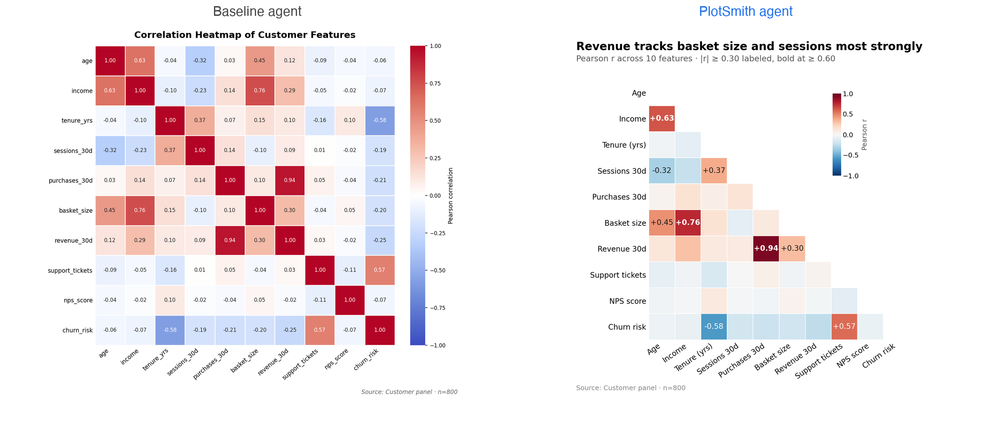
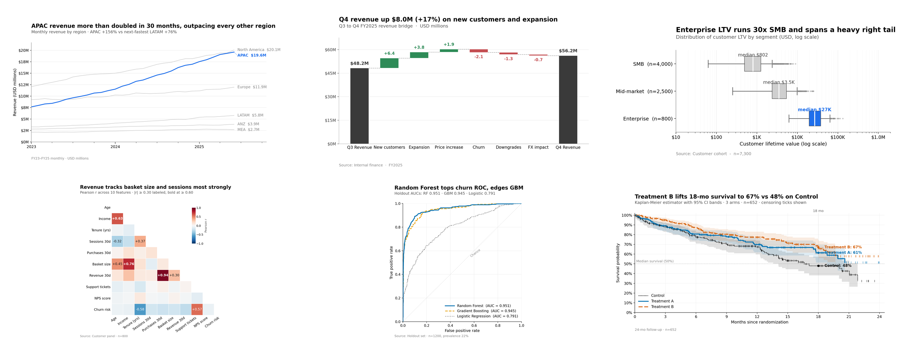
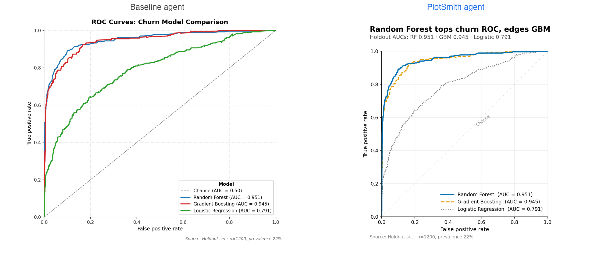

# PlotSmith

**Make plots your CFO will actually read.**

Ask any LLM to "plot this data" and you get back something technically
correct and visually mediocre: matplotlib defaults, rainbow palettes,
"Revenue by Month" titles, legends sitting on the data, 30% of the canvas
wasted on whitespace. Then you spend the next hour fixing it.

PlotSmith fixes that on the first render.



> Same Claude model, same one-sentence prompt. The only difference: the
> chart on the right was produced with PlotSmith's operating manual loaded.

> [!NOTE]
> **PlotSmith is not infallible.** It still occasionally picks a too-wide
> `figsize`, clips a long title on a narrow canvas, or interprets an
> unusual data shape literally. The self-verification loop catches most
> layout issues but is not a replacement for a human review on charts
> headed to a board deck. See the [honest limits](#honest-limits) below.

## Why this exists

1. **Stakeholder-grade charts are a craft** — rules like *"focal series
   in accent, peers in grey"* or *"the title states the finding, not the
   axes"* aren't in matplotlib's documentation, and LLMs learn syntax,
   not visual judgment.
2. **One-shot is the whole point.** If you needed three rounds of
   *"actually, can you…?"*, you wouldn't use an agent. That requires the
   rules to be encoded *in* the agent, not retyped into every prompt.
3. **Reuse beats prompting.** Encoding the expertise once, in a file you
   can share, beats retyping it forever.

PlotSmith is the file — a 480-line Markdown manual at
[`.claude/agents/plotsmith.md`](.claude/agents/plotsmith.md) that
[Claude Code](https://docs.claude.com/en/docs/claude-code/overview) loads
as a [sub-agent](https://docs.claude.com/en/docs/agents-and-tools/sub-agents).

## Six charts, one prompt each



No manual tuning. The agent picks chart type from data shape, sizes the
figure from a calibrated table, writes an insight-bearing title with a
quantified subtitle, picks one accent color against greys, formats numbers
as `$1.2M` not `1200000.0`, then renders a low-res preview, reads it back
as an image, scores it against a 20-point layout checklist, and re-renders
if anything is cramped or loose.

## Quick start

```bash
git clone https://github.com/rakesh-yadav/plotsmith.git
cd plotsmith

# Install globally so every project can use it
mkdir -p ~/.claude/agents
cp .claude/agents/plotsmith.md ~/.claude/agents/

pip install -r requirements.txt   # only if you'll run the benchmark
```

Restart Claude Code so it registers the sub-agent, then ask in plain
English:

```
> Use the plotsmith subagent to plot monthly active users from
  data/dau.csv, with the v2 launch and pricing change as event markers.
```

You'll get back a chart, the source script, and a one-line verification.

> [!TIP]
> **Make it yours.** PlotSmith encodes *one* opinionated house style —
> the palette, fonts, sizing, and chart defaults are calibrated for a
> specific aesthetic, not a universal one. **Strongly recommended:**
> fork [`.claude/agents/plotsmith.md`](.claude/agents/plotsmith.md) and
> tune it. Common customizations:
>
> - **Palette** (rule 6) — swap the categorical default for your brand
>   colors; replace the accent `#1f6feb`.
> - **Typography** (`MATPLOTLIB BASELINE`) — font family, sizes, weights.
> - **Title-block constants** (`title_y_in, subtitle_y_in, axes_top_in`)
>   — tighter or looser header to match your slide template.
> - **`figsize` rows** — tune for your aspect ratios (wide-screen deck,
>   Slack thread, PDF report).
> - **Cookbook recipes** — add domain-specific entries (KPI scorecard,
>   sparkline panel, funnel-with-segments).
> - **Source-caption format** — replace the generic "Source: …" with
>   your team's standard.
>
> The file is plain Markdown. The agent is a starting point, not a
> fixed standard.

## One more comparison



Baseline uses three saturated colors — you chase the legend to find the
winner. PlotSmith puts the focal model in accent blue solid, peers in
dashed orange and dotted grey — colorblind-safe, winner unmistakable.

Full per-chart write-up across 14 chart types in
[`benchmark/REPORT.md`](benchmark/REPORT.md).

## What the agent enforces

The full manual is in [`.claude/agents/plotsmith.md`](.claude/agents/plotsmith.md).
The condensed version:

| # | Rule | What it prevents |
|---|------|------------------|
| 1 | `figsize` from a calibrated table by chart family | The matplotlib 6×4 default, wrong for almost everything |
| 2 | No overlaps / clipping; layout via `subplots_adjust` (not `tight_layout`) | The single most common one-shot defect |
| 3 | Whitespace discipline — no empty rectangle ≥ 1″ on a side | Wasted canvas |
| 4 | Log scale when range ≥ 10×, with real-value tick labels | Unreadable log axes |
| 5 | Y-baseline rules per chart type (bars from 0, lines with headroom) | The "bars-start-at-50" lie |
| 6 | Insight-bearing titles + subtitle + source caption | "Revenue by Month"-style noise |
| 7 | Color discipline — one accent + greys; colorblind-safe palettes (Okabe-Ito, viridis) | Rainbow plots, legend-chasing |
| 8 | Number formatting via shared `fmt_num()` helper (`$1.2M`) | Raw scientific notation |

Plus 14 per-chart recipes, a token-efficient two-stage render strategy,
and a mandatory self-verification loop.

## Benchmark

PlotSmith vs. a vanilla Claude agent on the same prompt across 14 chart
types — data analytics, business analytics, data science, ML.

| | |
|---|---|
| Chart types tested | 14 |
| PlotSmith wins | 12 |
| Ties | 1 |
| Mixed | 1 |
| Cost premium | ~1.8× wall-clock |

Reproduce: `python benchmark/generate_data.py` then invoke the agent on
each task (prompts in [`REPORT.md`](benchmark/REPORT.md)). Seed=42.

## Honest limits

PlotSmith **does** make mistakes. Known rough edges:

- **Cohort triangle oversizes.** The figsize formula occasionally picks
  too wide a canvas. Tracked.
- **Long titles clip on narrow figures.** The narrow-figure guardrail
  helps but doesn't always fire on the first render.
- **Unusual data shapes get literal treatment.** If your data needs a
  custom chart type (e.g. a hexbin scatter, a violin-on-violin), the
  agent will often default to the closest cookbook recipe instead of
  inventing one.
- **~1.8× slower than naive plotting.** Worth it for charts that leave
  your workspace; overkill for a five-second sanity scatter.
- **Matplotlib-focused.** Plotly only where genuinely better (Sankey,
  sunburst, choropleth). For interactive HTML by default, this isn't it.
- **Opus-tuned.** Sonnet works but you'll see more literal prompt
  interpretation and fewer of the chart-type substitutions that make
  the output stand out.
- **English-calibrated.** The title character-count budget assumes
  English at 15pt 600-weight.

When the agent gets it wrong, the script is yours to edit — the manual
is enforced via prompt, not runtime, so any output is regular matplotlib.

## Repo layout

```
plotsmith/
├── .claude/agents/plotsmith.md   ← the agent definition (the product)
├── benchmark/                    ← 14-chart agent-vs-baseline showdown
│   ├── REPORT.md
│   ├── data/                     ← 15 CSVs
│   ├── plotsmith/  baseline/     ← 14 PNGs each
│   └── generate_data.py
├── docs/                         ← README assets + composite builder
├── requirements.txt
└── LICENSE                       ← Apache 2.0
```

## Credits & license

Agent definition by **Rakesh Yadav**. Built collaboratively with Claude.
[Apache 2.0](LICENSE) — fork, adapt, rebrand for your house style. Issues
and PRs welcome, especially new chart recipes, figsize refinements, and
non-English title-budget calibrations.
